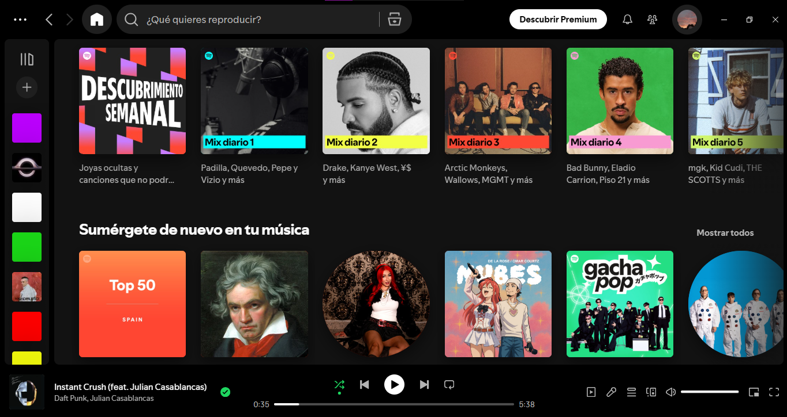
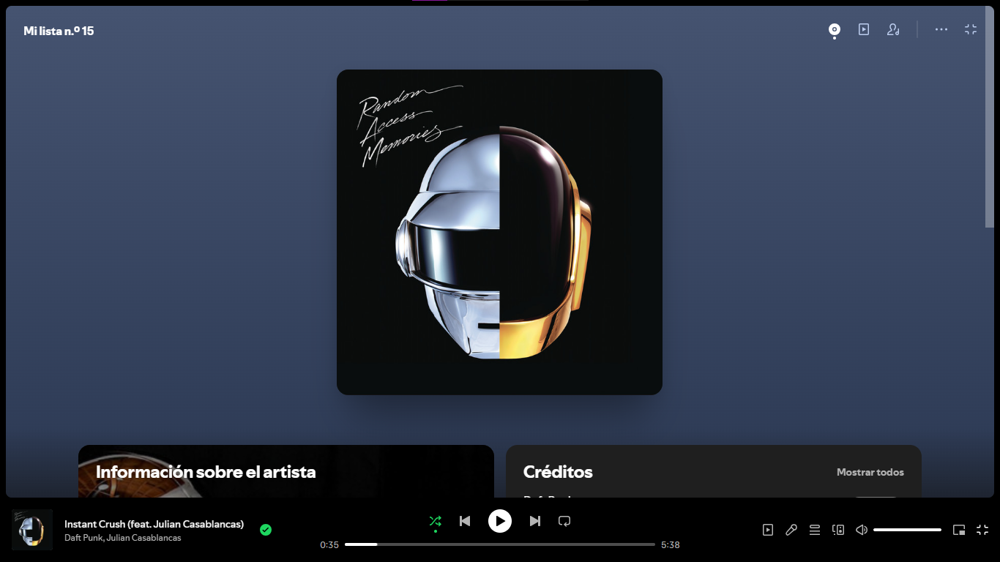
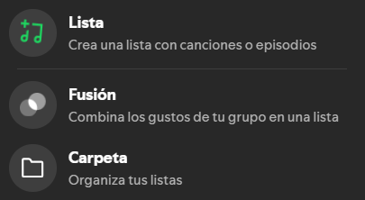

# SPOTIFY🎵
---

## Descripción del proyecto
Spotify es una plataforma de streaming digital que ofrece acceso a millones de canciones y pódcasts. Permite escuchar música en cualquier dispositivo, crear listas personalizadas y descubrir nuevos artistas mediante un sistema avanzado de recomendaciones.

## Funciones y aplicaciones

### Recomendaciones y selección

Gracias a su sistema de recomendaciones inteligentes, Spotify ayuda a descubrir nueva música todos los días. Ofrece mezclas diarias personalizadas, listas de reproducción que puedan interesarte en base a tus gutos, o las canciones mas escuchadas, además ofrece secciones temáticas clasificadas por generos y artistas. De esta forma, cada usuario encuentra contenido adaptado a sus gustos y preferencias en cada momento.

---

#### Reproductor interactivo

El reproductor de Spotify es de intuitiva y sencilla usabilidad (pausa, avanzar, retroceder, repetir o reproducción aleatoria) y una interfaz limpia para disfrutar al máximo tu música. También incluye detalles adicionales como la información sobre el artista, álbumes relacionados y créditos de cada canción, enriqueciendo la experiencia de escucha más allá del simple audio.

---

#### Playlists y organización

Spotify permite crear listas de reproducción personalizadas con canciones o pódcasts adaptados a cada momento. Además, puedes usar la función Fusión para combinar los gustos musicales de tu grupo de amigos en una sola lista compartida, o mantener todo en orden gracias a las carpetas de organización, que facilitan clasificar tus colecciones de música y pódcasts.
